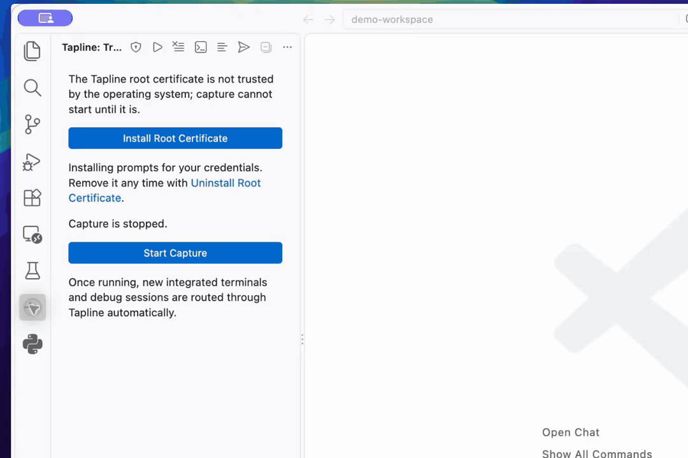

# Tapline

English | [简体中文](README.zh-CN.md)

[](https://marketplace.visualstudio.com/items?itemName=fqix.tapline)
[](https://open-vsx.org/extension/fqix/tapline)

Capture and inspect HTTP, HTTPS, HTTP/2, HTTP/3, gRPC, WebSocket and SSE traffic
without leaving VS Code. Integrated terminals and debug sessions are routed through a
local proxy that decrypts TLS with its own root CA; nothing else on the system changes.

Install from the [VS Code Marketplace](https://marketplace.visualstudio.com/items?itemName=fqix.tapline)
or [Open VSX](https://open-vsx.org/extension/fqix/tapline).

## Features

- **Charles-style views** — a _Structure_ tree (host → path → request) in the sidebar
  and one traffic panel: a sortable, filterable _Sequence_ table (status / method quick
  filters, per-host view, multi-select) with an inspector below or beside it. The
  inspector shows an overview with timing waterfall, request and response pages
  (headers, query, cookies, form and multipart fields, decoded JWTs, trailers, body as
  Pretty JSON / XML / Text / Hex / Image with find-in-body), WebSocket frames and SSE
  events streamed live. Compressed bodies (gzip, deflate, br, zstd) are decoded.
- **Rules** — breakpoints that pause a request or response for editing, rewrite
  (method, URL, status, headers, body), map local (answer with a file or inline body),
  map remote (send to another origin), block and throttle. Edited in the panel, stored
  in extension global storage (see below).
- **Compose** — write a request from scratch or _Edit & Resend_ a captured one; the
  reply appears in the table like any other.
- **Filter query** — `status:5xx method:post host:api.* path:/v1 type:json proto:grpc
size>10k dur>500 ip:10.0. body:"not found" header:x-id=1 -status:2xx`; plain words match the
  URL, method or status. _Statistics_ summarise the filtered rows per host with the
  slowest and largest responses.
- **gRPC decoding** — messages are split out of the length-prefixed body (gzip/deflate
  and gRPC-Web included) and decoded with the workspace's `.proto` files
  (`tapline.grpc.protoFiles`) or, without a schema, by field number; `grpc-status` drives
  the status colour and the method column reads _gRPC_.
- **Stream messages** — search, copy individual messages, pause display and follow
  latest for WebSocket, SSE and gRPC. Scrolling up freezes the view while capture
  continues. Filter WebSocket messages by direction and resend complete outgoing
  messages (including binary) on the original open connection. SSE search includes
  event names and IDs; complete gRPC messages appear before EOF, within the body
  retention limit. Closed connections and truncated messages cannot be resent.
- **Automatic capture** — new terminals and debug sessions (`node`, `python`, `go`,
  `java`, … configurable) get `HTTP(S)_PROXY` and the CA variables of common tools
  (`SSL_CERT_FILE`, `NODE_EXTRA_CA_CERTS`, `REQUESTS_CA_BUNDLE`, `CURL_CA_BUNDLE`,
  `GIT_SSL_CAINFO`, `JAVA_TOOL_OPTIONS`, …).
- **One-click root certificate** — install, trust and uninstall the CA in the OS
  store on macOS, Windows and Linux. Capture waits until the CA is trusted.
- **Compare with original** — open a replay against its original from the inspector or row menu.
- **Notes and markers** — annotate or star requests from the inspector or row menu.
  Annotations belong to the capture session for the lifetime of the captured request;
  clearing or evicting it also removes its annotations.
- **Copy response body** — copy retained content from the inspector or row menu;
  binary bodies copy as Base64.
- **Compare requests** — select two rows with Cmd/Ctrl-click and use _Compare Requests_
  in the selection toolbar or context menu. The native VS Code diff shows immutable
  request/response snapshots, with the earlier capture on the left. Headers are sorted,
  JSON is formatted, binary bodies use Base64, and incomplete captures are marked.
- **Copy as cURL, export HAR, replay**, status-bar controls, English and 简体中文 UI.
- **Window isolation** — each window gets its own capture data, controls and OS-assigned proxy port by default, while all windows in the same extension storage environment share one sing-box process and root CA. Closing a window dynamically removes its inlet and connections after a 3-second reconnect grace period; the last window shuts the agent and core down. Disable `tapline.isolateWindows` and reload to share one capture session.
- **MCP server** — Copilot Chat, Claude Code, Cursor and other MCP clients can list,
  search, read, replay and send captured requests (see below).

## Basic workflow



_Recorded in VS Code with Recordly, with focused zooms, cursor effects and a framed background. Waiting time is shortened._

1. Install and trust the root certificate, then start capture.
2. Send an HTTP request to **httpbin** and inspect its parameters, headers and JSON response.
3. Edit and resend the request, then compare it with the original in **Diff**.
4. Open `grpcbin.proto` and call **grpcbin** from a captured terminal. Inspect named request and response fields: `f_string`, `f_strings`, `f_int32` and `f_bool`.
5. Search messages, filter traffic with `proto:grpc`, then stop capture.

[Watch the MP4](docs/demo/tapline-walkthrough.mp4) · [Demo requests and recording notes](docs/demo/README.md)

## Settings

Open **Tapline: Settings** or the gear in the traffic panel. All settings and rules are saved in VS Code extension global storage, shared across projects in the same VS Code profile. Existing explicit global settings are migrated once; workspace settings are no longer used. Settings are no longer written to `settings.json`. The keys below identify controls in the panel.

| Setting                                     | Default          | Purpose                                   |
| ------------------------------------------- | ---------------- | ----------------------------------------- |
| `tapline.isolateWindows` | `true` | Isolate windows; reload after changing |
| `tapline.port`                              | `3606`           | Proxy port in shared mode (automatic in isolated mode)        |
| `tapline.autoStart`                         | `false`          | Start capture when VS Code opens          |
| `tapline.terminal.inject`                   | `true`           | Inject variables into new terminals       |
| `tapline.debug.inject` / `debug.runtimes`      | `true` / node, … | Inject into launched debug sessions       |
| `tapline.ssl.enabled` / `tapline.ssl.hosts` | `true` / `["*"]` | Which hosts are decrypted                 |
| `tapline.maxEntries` / `tapline.maxBodyKiB` | `2000` / `512`   | Transactions kept and body bytes retained |
| `tapline.mcp.enabled` / `tapline.mcp.port`  | `true` / `3607`  | MCP endpoint for AI assistants            |
| `tapline.grpc.protoFiles`                   | `["**/*.proto"]` | Schemas for decoding gRPC messages        |
| `tapline.rules`                             | `[]`             | Interception rules (see below)            |

## Rules

Rules apply in order to every request whose URL matches the rule's wildcard pattern
(`*` matches anything; a pattern without `*` is a prefix; empty matches all) and,
optionally, one of its methods. Open the editor with the ruler button in the traffic
panel or _Tapline: Rules…_; _Break on This URL_ in a request's context menu adds a
breakpoint for it. Rules are managed through the editor and saved globally. Example rule data:

```jsonc
[
    { "kind": "breakpoint", "url": "https://api.example.com/v1/orders*", "request": true, "response": true },
    { "kind": "rewrite", "url": "*/v1/*", "request": { "headers": { "X-Debug": "1", "Authorization": null } },
      "response": { "status": 500, "bodyReplace": { "pattern": "\"ok\":true", "replacement": "\"ok\":false" } } },
    { "kind": "mapLocal", "url": "*/users.json", "file": "mocks/users.json" },
    { "kind": "mapLocal", "url": "*/feature-flags", "body": "{\"beta\": true}", "status": 200 },
    { "kind": "mapRemote", "url": "https://api.example.com/*", "to": "http://localhost:8080" },
    { "kind": "block", "url": "*://telemetry.*", "status": 403 },
    { "kind": "throttle", "url": "*", "latencyMs": 800, "kbps": 256 }
]
```

| Kind         | Effect                                                                                                    |
| ------------ | --------------------------------------------------------------------------------------------------------- |
| `breakpoint` | Holds the request and/or response; the inspector shows an editor with _Continue_ and _Abort_.             |
| `rewrite`    | `method`, `url` (regex → replacement), `status`, `headers` (`null` removes), `body` or `bodyReplace`.     |
| `mapLocal`   | Answers with `file` (relative to the workspace or absolute) or `body`; `contentType` is guessed if unset. |
| `mapRemote`  | Sends the request to `to` (origin, optional path prefix), keeping the path and query; `Host` follows.     |
| `block`      | Refuses with `status` (default 403) without contacting the server.                                        |
| `throttle`   | Delays forwarding by `latencyMs` and paces both bodies at `kbps`.                                         |

Rewritten and edited bodies are sent uncompressed with `Content-Encoding` removed;
`text/event-stream` responses are never buffered, so only their status and headers can
change. Requests that a rule touched show a pencil in the table and the rule names in
the overview; `rule:any` filters them.

## Root certificate

The CA lives in the extension's global storage (`Tapline: Copy Root Certificate Path`).
With `tapline.ssl.enabled` on, capture starts only once the OS trusts it; the sidebar
and status bar offer to install it, and `Tapline: Uninstall Root Certificate` removes it.

| Platform | Store                                                           |
| -------- | --------------------------------------------------------------- |
| macOS    | login keychain via `security` (system password dialog)          |
| Windows  | current-user Trusted Root via `certutil` (confirmation dialog)  |
| Linux    | distribution anchor directory + update command, run with `sudo` |

Firefox and snap/flatpak browsers keep their own stores and need a manual import.
Set `tapline.ssl.enabled` to `false` to capture without decryption or any certificate.

## MCP server

The capture agent serves an [MCP](https://modelcontextprotocol.io) endpoint at
`http://127.0.0.1:3607/mcp` (Streamable HTTP; port and on/off in `tapline.mcp.*`) so AI
assistants can work from real traffic: `status`, `list_requests`, `search`, `get_request`,
`get_body`, `replay`, `send`, `export_har`, plus `start_capture` / `stop_capture` /
`set_recording` / `clear` / `delete`, and `tapline://requests/{id}` resources.

Run _Tapline: Configure MCP Server…_ (also in the traffic view's `…` menu) for a one-click
install in Cursor, the URL, an `mcp.json` snippet, or a `claude mcp add` command. The
endpoint is up while any window with Tapline is open — no extra process, no `node` on
`PATH` — and, like the proxy, listens on the loopback interface only.

## How it works

A Node agent drives a bundled, patched [sing-box](third_party/patches/sing-box/README.md):
sing-box terminates TLS with leaf certificates minted from the Tapline CA and streams
bodies through the agent, which records them and passes them on unchanged.

## Development

Requires Node 24 LTS, Go 1.27+ and git.

```sh
git clone --recurse-submodules https://github.com/fqix/tapline.git && cd tapline
nvm use               # Node 24 LTS (.nvmrc)
npm ci
npm run core:build     # patch and build sing-box into core/<platform>-<arch>/
npm run build          # esbuild → dist/
npm test               # vitest: unit tests plus integration tests against the core
npm run test:e2e       # the extension inside a real VS Code (downloads it on first run)
npm run package        # VSIX for this platform (package:all for all six)
```

Press F5 to launch the extension development host. CI builds, tests and packages every
platform on each push and runs the end-to-end suite on one runner per OS.

## Releasing

CI never publishes. Bump the version, push the tag and publish a GitHub release:

```sh
npm version patch && git push --follow-tags
```

The [release workflow](.github/workflows/release.yml) rebuilds all platforms, publishes
to the VS Code Marketplace (Azure managed identity over OIDC, no PAT) and Open VSX, and
attaches the VSIX files to the release.

## Licence

MIT. The bundled sing-box core is GPL-3.0; its source revision, patches and notices ship
next to each binary.

### MCP and window sessions

MCP keeps one fixed endpoint (`tapline.mcp.port`) for the shared agent. Call `list_sessions` to see the active windows, their `sessionId`, proxy port and state. All other tools accept `sessionId`: it may be omitted with a single session, but is required with multiple sessions. Request resources can use `tapline://sessions/{sessionId}/requests/{id}`. An external MCP connection does not keep capture processes alive after all windows close. If windows request different MCP ports, the active shared endpoint is retained while another window needs it.

Proxy ports are bound by the OS when each inlet is created, so concurrently active windows cannot receive the same port. Use the status bar or Copy Proxy Environment to obtain the current port; external programs must connect to the intended window's port. Closed ports may be reused later by the OS.
